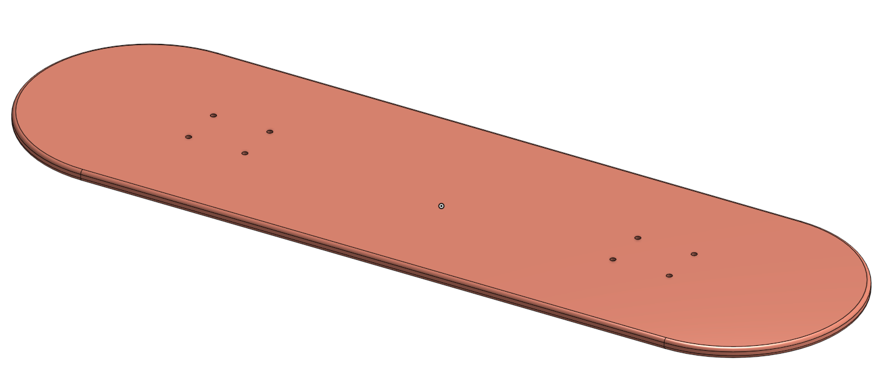
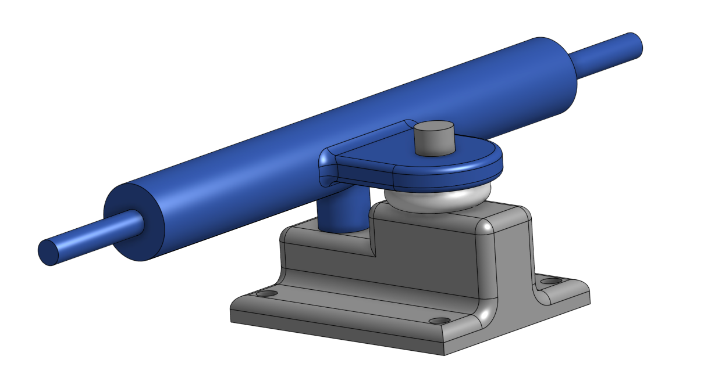
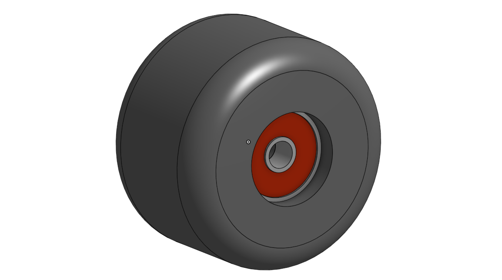
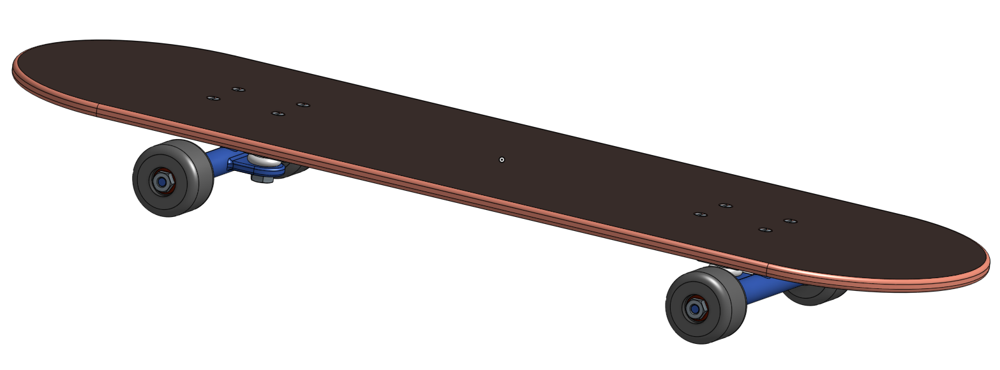

# NotSoBasicOnshapeCAD

This repo documents CAD work with Onshape in Engineering III.

## Table of Contents
* [CAD Swing Arm](#cad-swing-arm)
* [Skateboard Deck](#skateboard-deck)
* [Skateboard Trucks](#skateboard-Trucks)
* [Skateboard Wheels and Bearings](#skateboard-Wheels-and-Bearings)
* [Skateboard Final Assembly](#skateboard-Final-Assembly)
* [Configurations - Creation](#configurations---creation)
* [Configurations - Assembly](#configurations---assembly)

 
 

## CAD Swing Arm 

### Description

The first assignment was to replicate a swing arm part from a set of drawings. The assignment style was similar to a portion of the Onshape Associate Certification test.

### Evidence 

Configuration #1

Configuration #2

[Swing Arm Part](https://cvilleschools.onshape.com/documents/b27fb78945164dc920e277c3/w/1348a9d7a157243912fb7a22/e/1e6b48dc0cfd4b893ab35878?renderMode=0&uiState=6172ebfbdec4801e7ada9c52)

### Reflection
Creating this part from a drawing was more difficult than I expected. Combining the different drawing views with the various dimensions took several tries. Even though the part was made with simple extrudes, they were combined in relatively complex ways. Next time, I will spend more time analyzing the drawings before I actually start making the part!

 
 

## Skateboard Deck

### Description

The next assignment was to create a Skateboard, following an Onshape educational guide. The first part of this assignement was the Skateboard Deck, a simple flat board with rounded ends and two sets of four holes for the trucks to attach to.

### Evidence 

Image of Deck

[Skateboard Deck](https://cvilleschools.onshape.com/documents/c71823187d9b6b4808156abe/w/1749d5b3bdc6e9464559b0b1/e/2e918a52faac32990a51779b?renderMode=0&uiState=6172ebe2551f2a05127830f1)

### Reflection

This initial part was very simple and elegant. I was very impressed by the application Onshape managed to embed in the document, which had very well thought out and comprehensive instructions to create the part. In addition, there were tips along the way for basic keyboard shortcuts, such as **Shift+S** to create a sketch, **N** to view normal to sketch plane, **F** to fit the setch or model to the screen, **R** for a center point rectangle, and **C** for a center point circle.

 
 

## Skateboard Trucks

### Description

The second part of the Skateboard was to design the trucks, which help attach the wheels to the board itself. The trucks consisted of three main parts: the baseplate, the truck hanger, and the bushing. These parts were all designed in the same part studio as the deck to maximize efficiency by reusing geometry from the other parts.

### Evidence 

Image of Trucks

[Skateboard Trucks](https://cvilleschools.onshape.com/documents/c71823187d9b6b4808156abe/w/1749d5b3bdc6e9464559b0b1/e/2e918a52faac32990a51779b?renderMode=0&uiState=6172ebe2551f2a05127830f1)

### Reflection

The trucks were more complicated than the deck, taking significantly more time to create. I did make a mistake during this process, initially designing the baseplate backwards and having to completely redo it in reverse. I also felt that the instructions for this part could have benefited from being split into several different parts because such a large list of instructions is both daunting and difficult to navigate, two attributes which are not terribly beneficial for beginners.

 
 

## Skateboard Wheels and Bearings

### Description

Designing the wheels and bearings was the next part of the skateboard. They were created in a new part studio since they couldn't really benefit from sharing geometry with the other parts. The wheel was created using a revolve, and then the bearing was extruded from the inside of the wheel.

### Evidence 

Image of Wheel and Bearings

[Skateboard Wheel and Bearings](https://cvilleschools.onshape.com/documents/c71823187d9b6b4808156abe/w/1749d5b3bdc6e9464559b0b1/e/9e86e78560710dbd4f1f86e4?renderMode=0&uiState=6172ec43551f2a0512783422)

### Reflection

This section was simple and clearly didn't overcomplicate the parts. At the end of the instructions there was a [short video](https://www.onshape.com/academic/intro-to-cad/lesson-2-1-5-designing-a-skateboard/assets/61548e5bb6538ff5b51d0ac42.3%20optional%20design%202.mp4) detailing how much time can be saved by simply using a revolve instead of many extrusions. It pays to think about your design before launching right into it.

 
 

## Skateboard Final Assembly

### Description

The final step of creating the Skateboard was to put it all together in a final assembly. The bill of materials is as follows:

 Name | Quantity
 --- | ---
 Baseplate | 2
 Bushing  | 2
 Deck | 1
 Truck Hanger | 2
 Bearing | 8
 Wheel | 4
 Countersunk Bolt #10-32 x 0.88 | 8
 Hex machine screw nut #10-32 | 8
 Hex machine screw nut 5/16-24 | 4
 Hex machine screw nut 3/8-24 | 2

### Evidence 

Image of Final Skateboard Assembly

[Skateboard Assembly](https://cvilleschools.onshape.com/documents/c71823187d9b6b4808156abe/w/1749d5b3bdc6e9464559b0b1/e/726b097b4f7073003f1133ae?renderMode=0&uiState=6172ec56551f2a05127834fd)

### Reflection

The assembly was fairly simple, with relatively few parts. I ws introduced to the [replicate tool](https://cad.onshape.com/help/Content/replicate.htm), which enables the easy replication of features. It was most useful for getting rid of the monotony of placing nuts and bolts into the assembly. Another useful thing I found from the instructions was that the keyboard shortcut for hiding and showing mate connectors is **K**. As an often used action in my workflow, I found it much easier to use the keyboard shortcut. 

 
 

## Configurations - Creation

### Description

The next CAD assignment was to create Legos using configurations. The first part was to create the parts and the configurations so that we could assemble them into a duck in the second part. The Lego bricks were created using variables so that they could be controlled by the configurations. 

### Evidence

### Reflection

Creating a part with configurations was not particularly difficult, but I did find out about a handy trick that's useful when creating putting parts into assemblies. In order to make the Lego blocks fit together better, we made custom mate connectors for in the part studio using a pattern. TIP: when creating this pattern, make sure that ***Apply Per Instance*** is checked.

 
 

## Configurations - Creation

### Description

The second and final part of the configuration assignment was to assemble some of the parts into a duck shape. Below is a list of the parts and configurations:

### Evidence

### Reflection

 
 